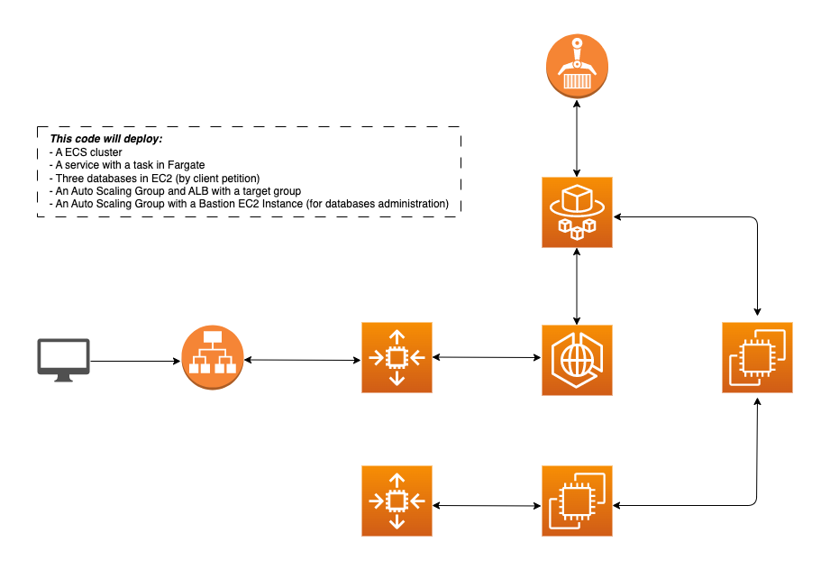

# Terraform ECS Fargate with Databases on EC2 

With this template will deploy a complete project with all the necessary components for its operation.
 Customize the project, you can remove modules like the "ec2-database" module if necessary. 

## Structure
The main structure is:
| Name | Description |
|:------|-------------|
| [main.tf](main.tf) | Building AWS modules |
| [variables.tf](variables.tf) | Writable file for the project, S3 bucket backend for storing Terraform remote state  |
| [provider.tf](provider.tf) | AWS provider, Terraform state |
#### Important (before initial "terraform apply")
The generated [.tfstate](provider.tf) is not stored in the remote state S3 bucket. Make sure the base [.tfstate](provider.tf) is registered in your infrastructure repository. You will have to modify this if you want to store it.

## Modified documents
In the file "variables.tf" you find everything that the variables modify.
| Variable name | Description | Optional |
|:------|-------------|:----:|
| General | General settings |  |
| [project_name](variables.tf) | Indicates the name of the project |  |
| [vpc-id](variables.tf) | Existing vpc id |  |
| [subnet_public](variables.tf) | Id of existing public subnets |  |
| [subnet_private](variables.tf) | Id of existing private subnets |  |
| [subnet_isolated](variables.tf) | Id of existing isolated subnets |  |
| [subnet_private_cidr](variables.tf) | CIDR of existing private subnets |  |
| [subnet_isolated_cidr](variables.tf) | CIDR of existing isolated subnets |  |
| [keypair](variables.tf) | Keypair already created |  |
| Bastion | EC2 instance bastion module | Yes |
| [ami_id_bastion](variables.tf) | Bastion ami (Currently Amazon linux 2023) |  |
| [instance_type](variables.tf) | Instance type bastion |  |
| [desired_capacity_min_max](variables.tf) | ASG desired capacity (min - max) |  |
| Ecs | ECS module |  |
| [docker_port](variables.tf) | Load balancer listener port|  |
| [target_group_port](variables.tf) | Target group port |  |
| [ami_id_ecs_cluster](variables.tf) | Cluster ami (Currently Amazon linux 2023) | Yes |
| [instance_type_ecs](variables.tf) | Instance type ecs | Yes |
| [task_cpu](variables.tf) | Cpu used by task definition |  |
| [task_memory](variables.tf) | Memory used by task definition |  |
| [app_image](variables.tf) | Image from ECR |  |
| [app_logs](variables.tf) | Name for cloudwatch logs |  |
| [app_count](variables.tf) | Number of docker containers to run |  |
| Databases | Database module | Yes |
| [instance_type_ec2db](variables.tf) | Instance type Ec2 instances | Yes |
| [count_databases](variables.tf) | Desired databases | Yes |
| [disk_size](variables.tf) | Disk size for EC2 instances | Yes |

## About me
https://github.com/sebaswk
